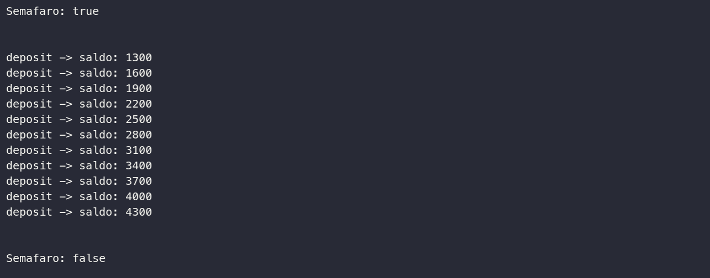
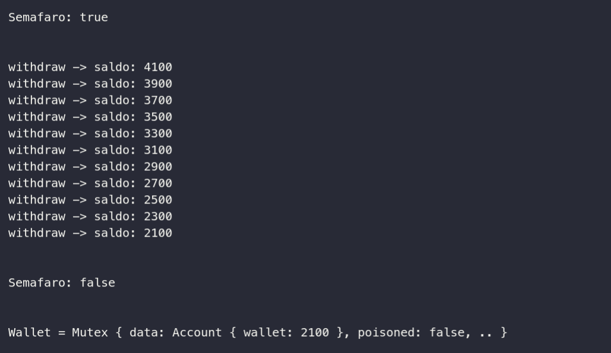

# Algoritmo Semáforo

Este projeto tem como objetivo implementar o algoritimo semáforo binário proposto por Dijkstra em 1965.

## Objetivo

Impedir que threads paralelas sejam executadas ao mesmo tempo, ao utilizar o algoritmo o programa deve executar as threads sequencialmente.

## Setup

Para executar o arquivo binário basta executar:

```shell
$ ./target/debug/bank_thread
```

Caso queira instalar o rust: 
```shell
$ curl --proto '=https' --tlsv1.2 -sSf https://sh.rustup.rs | sh
```

Para rodar o projeto usando o rust:

```
$ cargo run
```

## Output




## Logs

Em anexo ao repositório contem uma pasta logs com registros das execuções no macOS e ubuntu.

Os arquivos marcados como V1 são implantações do programa sem o algoritmo. E os arquivos v2 contêm o algoritmo implementado.

## Observações

A execução das threads varia conforme o OS utilizado, para comparar veja os arquivos `v1` do MacOS e Ubuntu.